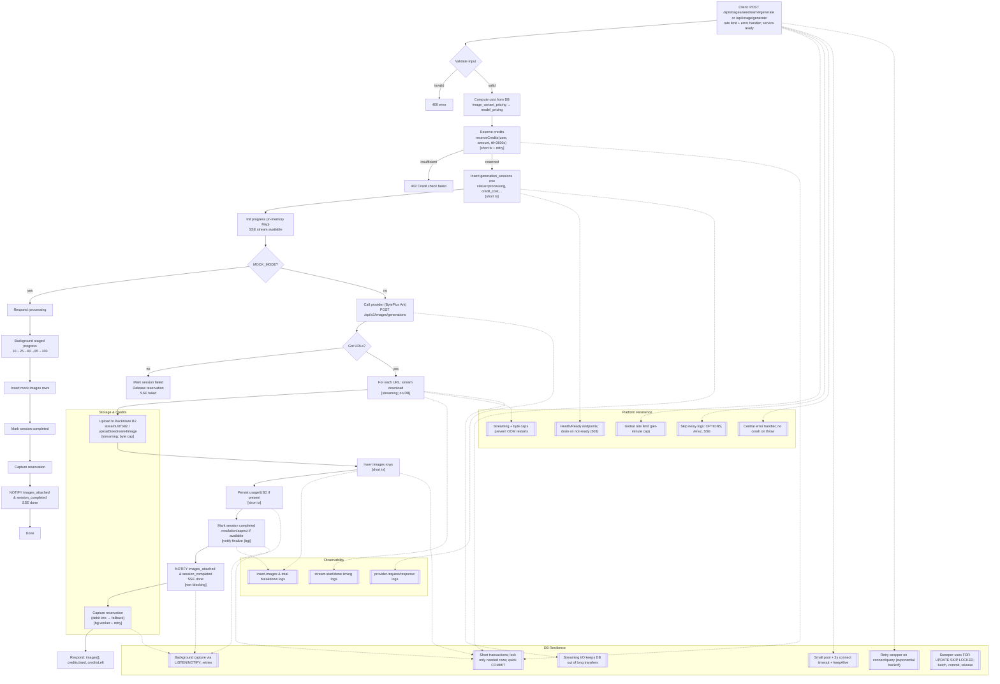

```mermaid
flowchart TD
  A["Client: POST /api/images/seedream4/generate or /api/image/generate<br/>rate limit + error handler; service ready"] --> B{Validate input}
  B -- invalid --> Bx[400 error]
  B -- valid --> C["Compute cost from DB<br/>image_variant_pricing → model_pricing"]
  C --> D["Reserve credits<br/>reserveCredits(user, amount, ttl=3600s)<br/>[short tx + retry]"]
  D -- insufficient --> Dx[402 Credit check failed]
  D -- reserved --> E["Insert generation_sessions row<br/>status=processing, credit_cost,...<br/>[short tx]"]
  E --> F["Init progress (in-memory Map)<br/>SSE stream available"]
  F --> G{MOCK_MODE?}

  G -- yes --> H1[Respond: processing]
  H1 --> H2["Background staged progress<br/>10→25→60→85→100"]
  H2 --> H3[Insert mock images rows]
  H3 --> H4[Mark session completed]
  H4 --> H5[Capture reservation]
  H5 --> H6[NOTIFY images_attached & session_completed<br/>SSE done]
  H6 --> H7[Done]

  G -- no --> I["Call provider (BytePlus Ark)<br/>POST /api/v3/images/generations"]
  I --> J{Got URLs?}
  J -- no --> Jx[Mark session failed<br/>Release reservation<br/>SSE failed]
  J -- yes --> K["For each URL: stream download<br/>[streaming; no DB]"]
  K --> L["Upload to Backblaze B2<br/>streamUrlToB2 / uploadSeedream4Image<br/>[streaming; byte cap]"]
  L --> M["Insert images rows<br/>[short tx]"]
  M --> N["Persist usage/USD if present<br/>[short tx]"]
  N --> O["Mark session completed<br/>resolution/aspect if available<br/>[notify finalize (bg)]"]
  O --> P["NOTIFY images_attached & session_completed<br/>SSE done<br/>[non-blocking]"]
  P --> Q["Capture reservation<br/>(debit lots → fallback)<br/>[bg worker + retry]"]
  Q --> R["Respond: images[], creditsUsed, creditsLeft"]

  %% Cross-cutting
  subgraph Storage & Credits
    L
    Q
  end

  subgraph Observability
    S1[[provider.request/response logs]]
    S2[[stream.start/done timing logs]]
    S3[[insert.images & total breakdown logs]]
  end

  %% Platform Resilience (Render outage defenses)
  subgraph Platform Resilience
    P1[["Health/Ready endpoints; drain on not-ready (503)"]]
    P2[["Global rate limit (per-minute cap)"]]
    P3[["Skip noisy logs: OPTIONS, /envz, SSE"]]
    P4[["Central error handler; no crash on throw"]]
    P5[["Streaming + byte caps prevent OOM restarts"]]
  end

  %% DB Resilience
  subgraph DB Resilience
    R1[["Small pool + 3s connect timeout + keepAlive"]]
    R2[["Retry wrapper on connect/query (exponential backoff)"]]
    R3[["Short transactions; lock only needed rows; quick COMMIT"]]
    R4[["Streaming I/O keeps DB out of long transfers"]]
    R5[["Background capture via LISTEN/NOTIFY; retries"]]
    R6[["Sweeper uses FOR UPDATE SKIP LOCKED; batch, commit, release"]]
  end

  I -.-> S1
  K -.-> S2
  M -.-> S3
  O -.-> S3

  %% Link to Platform resilience
  A -.-> P2
  A -.-> P3
  A -.-> P4
  E -.-> P1
  K -.-> P5

  %% Link core steps to DB resilience mechanisms
  A -.-> R1
  A -.-> R2
  D -.-> R3
  E -.-> R3
  K -.-> R4
  M -.-> R3
  N -.-> R3
  O -.-> R5
  P -.-> R5
  Q -.-> R5
```