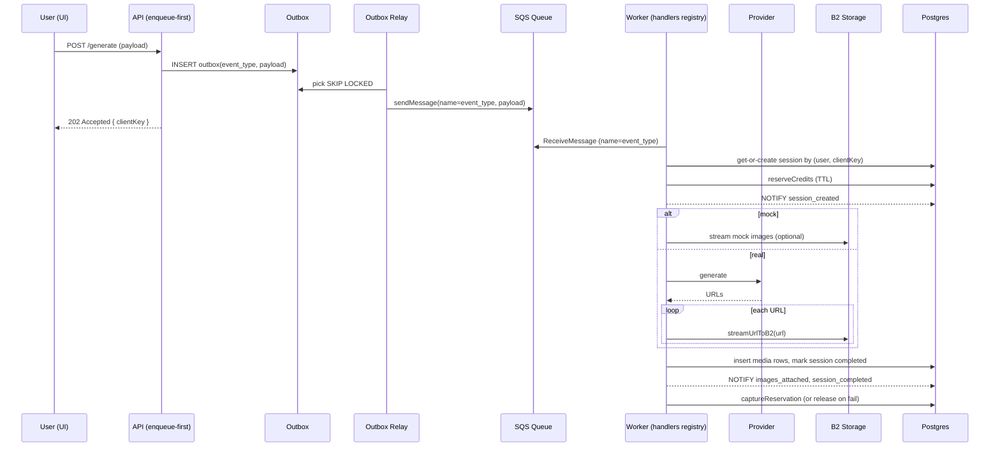

## Enqueue-first generation architecture

### Why we changed it
- Avoid OOM and long-lived HTTP/database work in request path
- Absorb bursts with backpressure and retries
- Produce exactly-once side effects via idempotency

### High-level
- Centralized, pluggable pipeline using Outbox + AWS SQS + Worker handlers.
- API (enqueue-first) validates, estimates cost, and uses a generic `enqueueGeneration` helper to reserve credits, pre-insert a session (optional), write to `outbox`, then returns 202.
- An Outbox Relay polls `outbox` (FOR UPDATE SKIP LOCKED), dispatches rows to SQS using `event_type` as the job name.
- The Worker long-polls SQS and uses a handlers registry to route messages to the appropriate tool handler (e.g. `gen.seedream4`).
- Handlers do the heavy work: provider calls, streaming to B2, DB inserts, and credits capture/release. Retries with backoff on transient errors.
- Idempotency is enforced via `(user_id, client_key)` and `credit_transactions.reservation_id`.
- Job payloads now include a versioned envelope `{ payloadVersion, jobType, params, meta }`, where `meta` carries precomputed hints such as `requestedOutputs`, `resolution`, and `model` so handlers can recover when upstream omitted derived fields.

### Request lifecycle (centralized enqueue-first)
1) Validate payload, compute/accept `clientKey` (UUID if not provided), detect mock via `shouldMock(tool, req)`.
2) Compute estimated credit cost for the tool/model.
3) Call `services/enqueue.enqueueGeneration({ jobType, userId, clientKey, params, cost, model, mockFlag, preInsertSession: true })`.
   - Reserves credits (short TTL)
   - (Optional) pre-inserts `generation_sessions` with `status='processing'` and `input_settings`, emits `NOTIFY session_created`
   - Inserts `outbox(event_type=jobType, payload)` and returns `{ reservationId, sessionId, outboxId }`
4) Return `202 Accepted` with `{ clientKey, reservationId, sessionId, status: 'queued' }`.

Env flag to enable: `ENABLE_ENQUEUE_FIRST=true`

### Outbox relay lifecycle
1) Polls `outbox` with `FOR UPDATE SKIP LOCKED`, batches by `OUTBOX_BATCH`.
2) For each row: derives `jobName = event_type`, calls `sendMessage` to push `{ ...payload, outboxId }` onto `SQS_MAIN_QUEUE_URL`, then sets `dispatched_at`.
3) Unknown event types are logged and skipped for later handling.
4) If the queue URL is missing or credentials are invalid the relay backs off and logs `outbox.queue_missing`, making misconfiguration obvious.

### Worker lifecycle (generic)
For each job (name = `event_type`, e.g., `gen.seedream4`):
1) Idempotent session get-or-create:
   - If `(user_id, client_key)` session exists, reuse it.
   - Otherwise, compute pricing and create `generation_sessions` row with `status='processing'`, `client_key`, and `reservation_id` (see below).
2) Reserve credits with TTL:
   - `reserveCredits(userId, cost, { ttlSeconds: 3600 })`
   - On success, store `reservationId` on the session
   - On insufficient credits, mark session `failed` and exit (retry won’t double charge).
3) Notify UI that a session exists:
   - `NOTIFY session_created` with `{ user_id, reservation_id, session_id }`
4) Provider call (real or mock):
   - Real: call external API(s) with appropriate timeouts
     - If the provider ignores batched requests (e.g. Seedream 4 with `n>1`), issue multiple calls in batches until `requestedOutputs` are satisfied. Batch size can be tuned with env knobs such as `SEEDREAM4_PROVIDER_BATCH`.
   - Mock: generate N sample image/video URLs
5) Stream media to B2 (memory safe):
   - Use `utils/storage.streamUrlToB2(url → B2)` with axios streams, a Transform byte limiter, and `@aws-sdk/lib-storage` multipart upload.
   - Enforce `MAX_IMAGE_DOWNLOAD_BYTES`/`MAX_REMOTE_DOWNLOAD_BYTES` caps.
6) Insert media rows and finalize session:
   - Insert `images`/`videos` with B2 info and `client_key`
   - Update session to `completed`, set `completed_at`, optional resolution/aspect
   - `NOTIFY images_attached` and `NOTIFY session_completed`
7) Credits capture or compensation:
   - Success: `captureReservation(reservationId)` (ledger rows include `reservation_id`)
   - Failure: `releaseReservation(reservationId)`

### Idempotency strategy
- `client_key` columns on session tables (`generation_sessions`, `video_generation_sessions`, `sora_video_sessions`, `veo31_video_sessions`). Add a unique index when feasible (nullable unique) or enforce uniqueness in code.
- Outbox writer enforces idempotency before dispatch; duplicate `clientKey` rows are skipped upstream so SQS receives at most one payload per reservation.
- `credit_transactions.reservation_id` enables idempotent capture logging.

Schema checklist
- Sessions tables contain `client_key TEXT` + index.
- Media tables (`images`, `videos`) allow `client_key` (optional but useful for traceability).
- `credit_transactions.reservation_id UUID` with FK to `credit_reservations`.

### Queue and backpressure
- `GEN_WORKER_CONCURRENCY` bounds parallel DB/provider work (max 10 per SQS poll).
- SQS handles retry attempts via `maxReceiveCount`; the worker can forward permanent failures to the DLQ immediately.
- The worker re-polls SQS immediately when it has capacity (default `SQS_IDLE_DELAY_MS=0`), keeping queue wait ~instantaneous unless you explicitly add a delay.
- Circuit breaker on API avoids new POSTs when DB is unstable.
- A Postgres `LISTEN session_completed` bridge inside `seedream4` broadcasts SSE `done`/`failed` so the UI reflects completion even when the result is beyond the first pagination page.

### Streaming + memory safety
- All remote media are streamed directly to B2; no full in-memory buffering.
- Byte caps enforced via Transform limiter.
- Multipart upload via `@aws-sdk/lib-storage` avoids content-length pitfalls.

### Mock mode
- `shouldMock(tool, req)` checks (in order): per-request override header (`x-mock-override`), `app_settings`, env.
- If mock and `upload_mock_outputs_to_b2=true`, mock outputs are also streamed to B2 for parity.

### Logging and observability
- Pino JSON logs with consistent fields and event names (e.g., `queue.enqueue`, `worker.init`, `provider.request`, `storage.stream.start/done`, `completed.mock/real`).
- Workers emit `job.payload.summary` logs capturing payloadVersion, requested outputs, resolution, and mock flag to simplify troubleshooting.
- `pino-http` filters OPTIONS/SSE noise and supports sampling on frequent 2xx.
- `/healthz` and `/readyz` endpoints; DB circuit breaker returns 503 to shed load during outages.

### Configuration
- `ENABLE_ENQUEUE_FIRST=true` – route enqueues and return 202; no DB work in request path
- `SQS_MAIN_QUEUE_URL=https://sqs.<region>.amazonaws.com/<account>/coolyai-generation`
- `SQS_DLQ_QUEUE_URL=https://sqs.<region>.amazonaws.com/<account>/coolyai-generation-dlq`
- `AWS_REGION=us-west-2` – also required by the SQS client
- `GEN_WORKER_CONCURRENCY=5` – worker parallelism (max 10 per poll)
- `SQS_WAIT_TIME_SECONDS=10`, `SQS_VISIBILITY_TIMEOUT=120` – tune polling cadence and processing window
- `SQS_IDLE_DELAY_MS=0` – optional backoff after empty polls; leave at `0` for near-instant picks, raise if you want to reduce ReceiveMessage calls
- `GEN_WORKER_SETTINGS_REFRESH_MS=30000` – how often the worker checks `app_settings` for overrides
- `gen_worker_concurrency` (Admin → Settings) – optional override stored in `app_settings`; when set, it supersedes `GEN_WORKER_CONCURRENCY` without redeploys
- `APP_SETTINGS_CACHE_MS=5000` – cache TTL for `utils/appSettings` helper; keep small so admin toggles (e.g., B2 mock uploads) propagate quickly

```env
GEN_WORKER_CONCURRENCY=3
SQS_WAIT_TIME_SECONDS=10
SQS_VISIBILITY_TIMEOUT=120
SQS_IDLE_DELAY_MS=0
```
- `MAX_IMAGE_DOWNLOAD_BYTES`, `MAX_REMOTE_DOWNLOAD_BYTES` – streaming caps
- `upload_mock_outputs_to_b2` – app_settings toggle for mock uploads

### Applying to another tool (step-by-step)
1) Define a job name for the tool (event type):
   - Images: `gen.seedream3`, `gen.seedream4`
   - Videos: `gen.seedance`, `gen.sora`, `gen.veo31`
2) Implement the worker handler in `src/queue/jobs/<tool>.js`:
   - Export `handler` (or `process<PascalTool>`) and a `jobNames` array, e.g. `module.exports = { handler: processFoo, jobNames: ['gen.foo', 'foo'] }`.
   - The auto-loader in `queue/handlers` will pick up the file on startup—no manual registry edits required.
3) In the API route, switch to the centralized helper:
   - Compute `clientKey`, `mockFlag`, `estimatedCost`
   - Call `enqueueGeneration({ jobType: '<event_name>', userId, clientKey, params, cost: estimatedCost, model, mockFlag, preInsertSession: true })`
   - Return 202 with `reservationId` and `sessionId`
4) (Optional) If you need legacy/inline fallback, guard with `FORCE_OUTBOX_ONLY=false` and `ENABLE_ENQUEUE_FIRST=false`.
5) Ensure schema for the new tool’s tables (if separate): `client_key`, NOTIFY channels, and use `credit_transactions.reservation_id`.

### Failure modes and how we handle them
- DB transient errors: short timeouts, small pools, retries with jitter, circuit breaker on API, enqueue-first removes DB from request path
- Provider failures: worker retries with backoff; DLQ if configured
- B2/network issues: streaming retries at small granularity; multipart upload is resilient
- Duplicate deliveries: idempotency via `client_key` and `reservation_id`

### Testing
- Use the Admin dashboard Load Test (UI parity mode if needed) to simulate users and models.
- Verify in API logs: `outbox.write` → `outbox.dispatched` and 202 responses.
- Verify in worker logs: `worker.ready` → `job.start name="gen.<tool>"` → `completed.mock/real`.
- Check DB rows: `outbox.dispatched_at`, `generation_sessions.status=completed`, `images/videos` inserted, and captured credits with `reservation_id`.
- Use the CLI harness `npm run diag:queue -- --user <uuid> --job gen.seedream4 --outputs 4` for quick regression checks; it enqueues a job, polls Postgres for session completion, and prints session/image summaries.

### Sequence diagram (centralized)


### Security & correctness notes
- Keep HTTP handler side-effect free (no DB) when enqueue-first is enabled.
- Validate and sanitize inputs early; store an `input_settings` snapshot in the session for auditability.
- Use per-request mock override JWT only for admin load tests; default to app_settings/env in production.


